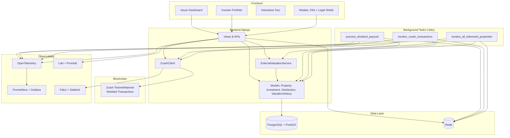

# ZReal Architecture Diagram

## Key Components

| Layer              | Technology                          | Responsibility |
|--------------------|-------------------------------------|----------------|
| **Frontend**       | Django Templates + Tailwind         | Premium UI for Issuers & Investors |
| **Backend**        | Django + DRF                        | Business logic, APIs, Auth |
| **Valuation**      | `ExternalValuationService`          | Heuristic + External API |
| **Blockchain**     | `ZcashClient` + `z_sendmany`        | Shielded ZSA & Dividend txs |
| **Background**     | Celery + Redis                      | Dividends, Monitoring, Re-valuation |
| **Data**           | PostgreSQL + PostGIS                | Core data + geospatial |
| **Observability**  | OTel + Prometheus + Grafana + Loki + Falco | Full visibility + security |

## Data Flow Highlights

- **ZSA Issuance** → `ZcashClient` → Shielded tx + rich memo
- **Dividend Payout** → Celery → `ZcashClient.distribute_shielded_payments()` → On-chain
- **Valuation** → `ExternalValuationService` → Heuristic or External API → History saved
- **Real-time** → WebSocket (Channels) + `DashboardEvent` model

This architecture is designed to be **scalable, auditable, and privacy-first**.
